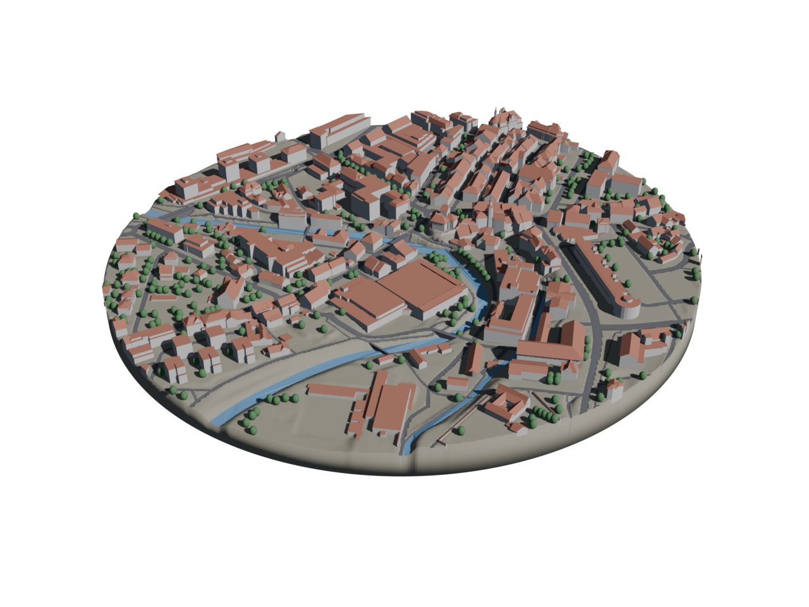
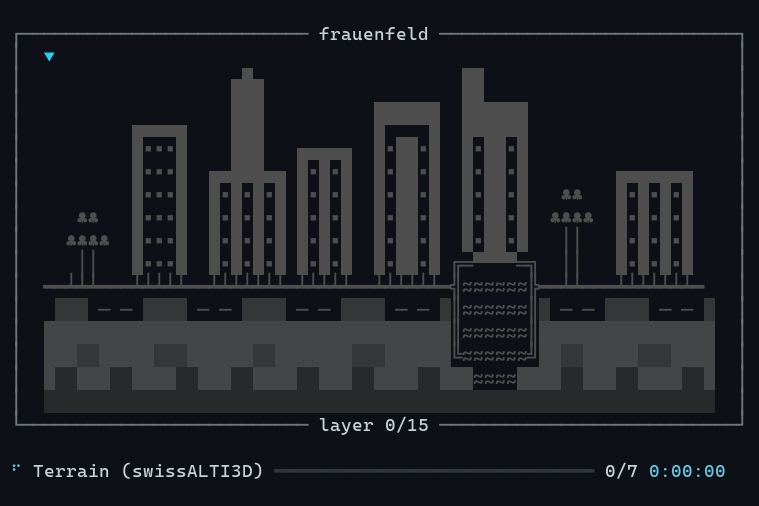
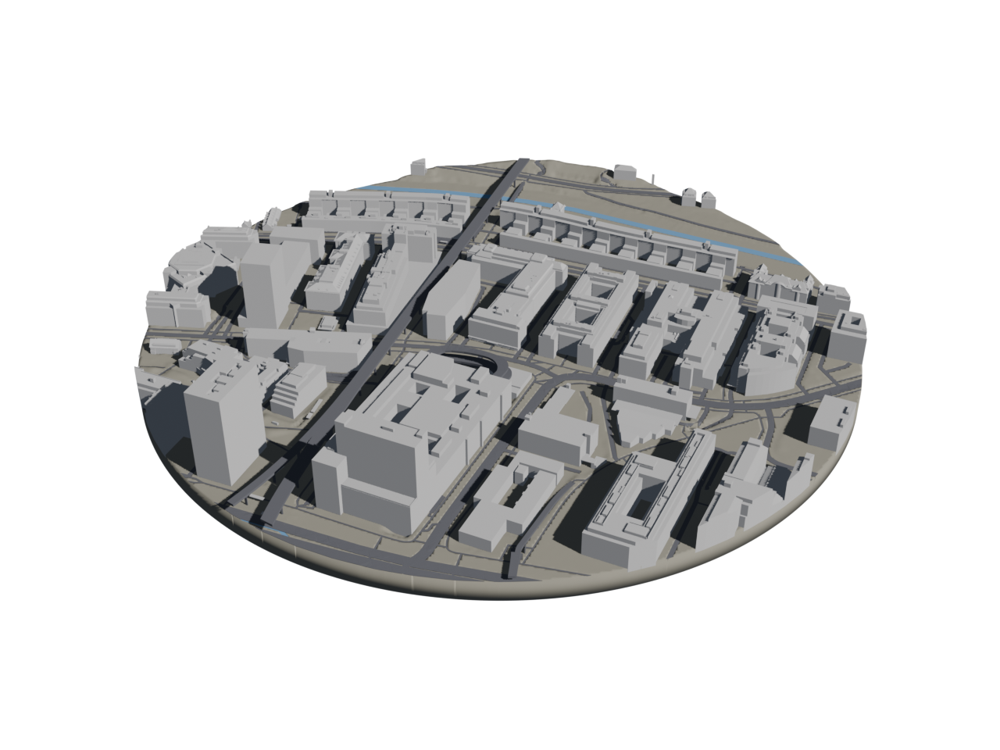

# diorama-generator

Generate 3D-printable dioramas of Switzerland from a location and a radius.
The pipeline geocodes the location, pulls swisstopo terrain, buildings, and
roads/water, assembles a circular diorama puck, and writes a `.blend` (for
post-processing in Blender) and a colored `.3mf` (for slicing/3D printing).



## Data sources

| Layer            | Source                                              |
|------------------|-----------------------------------------------------|
| Terrain (DTM)    | swissALTI3D (swisstopo STAC, 2 m GeoTIFF tiles)     |
| Buildings        | swissBUILDINGS3D 3.0 (swisstopo STAC, FileGDB tiles)|
| Roofs            | swissBUILDINGS3D 3.0 `Roof_solid` (incl. overhangs) |
| Roads & water    | `--source tlm` (default) or `--source osm`          |
| Trees (optional) | swissTLM3D forest fill + single trees (`--trees`)   |
| Base (optional)  | any pedestal mesh (`--base <path>`, see below)      |
| Buildings (Zürich) | Stadt Zürich weekly city model (auto inside Zurich) |

**Roads/water source.** Two interchangeable backends behind the same interface:

- `tlm` (default, `features_tlm.py`): swissTLM3D, swisstopo's authoritative
  vectors, so roads/water align with the buildings/terrain. Published only as a
  single whole-country FileGDB, downloaded and cached once (~2.9 GB); after
  that every AOI is a fast bbox query. Roads carry width classes; water is
  rivers (`TLM_FLIESSGEWAESSER`, above-ground) plus lakes/wide rivers
  (`TLM_BODENBEDECKUNG`).
- `osm` (`features_osm.py`): OpenStreetMap via Overpass. Light, instant, no big
  download. Streets can be off by a few metres from the swisstopo buildings.

**Buildings & roofs.** swissBUILDINGS3D 3.0 ships two variants in the same
FileGDB: `Building_solid` (the closed building body) and `Roof_solid` (the roof
as its own solid, *including overhangs*, which the building body omits). Both
are rendered: walls in light gray, roofs as a separate `roofs` category in
terracotta. This way roof shapes and overhangs show, and roofs can be printed
or recolored independently.

**Water shape.** Rivers (flowing water) are draped down the slope like roads;
lakes (standing water) are placed as one flat surface. Both backends split the
two so a mountain river follows its valley instead of being flattened and carved
into the hillside.

**Bridges.** TLM-tagged bridges (`KUNSTBAUTE=Bruecke` / elevated `STUFE`) are
built as a level causeway: a flat deck at the abutment height with solid fill
down to the valley floor, so a road spans a gorge or river instead of dipping
into it (and stays 3D-printable). Small untagged crossings still follow the
terrain.

**Trees (`--trees`).** An optional layer of green ellipsoids: forest polygons
(`TLM_BODENBEDECKUNG` = Wald) are filled with a jittered-grid scatter and every
`TLM_EINZELBAUM` single tree is placed too. swissTLM3D carries no tree heights,
so all trees share one height; each is a watertight ellipsoid embedded ~1 m into
the terrain for print connectivity. Road and water footprints (plus a small
clearance) are kept tree-free, so forest roads stay visible. Off by default.

**Base (`--base cylinder|table|<path>`).** By default (`cylinder`) the diorama
is the plain terrain puck: the disc with a straight skirt down to the base
slab, ready to print as-is. To seat the puck in a pedestal instead, pass
`--base <path>` with any mesh file, or `--base table` for the reference
compass table at `assets/table.fbx` (a third-party asset that is not shipped
with the repo, see Setup). Either way, a pocket is carved into the pedestal's
top face and the puck sinks into it until the lowest terrain point *on the
rim* (the visible seam) is flush with the top. Only relief rises above the top
face; interior dips like a riverbed sit deeper inside the pocket. Alignment
samples the DTM surface only, since building foundations and road/river inlay
bottoms reach deeper but stay inside the pocket. Mesh requirements and the
exact processing steps are in "Custom base meshes" below.

## Pipeline

```
coordinate + radius
  -> swissALTI3D tiles  -> merged DTM -> circular terrain puck (Delaunay disc)
  -> swissBUILDINGS3D    -> building + roof solids clipped to the AOI
  -> swissTLM3D / OSM    -> roads & water extruded into inlay solids
  -> manifold boolean    -> inlays carved out of the terrain puck
  -> trimesh             -> diorama.glb  (named per-category meshes)
                         -> diorama.3mf  (per-category colors, slicer-ready)
  -> Blender (headless)  -> diorama.blend (+ preview.png)
```

The circular cut is done analytically in Python (a Delaunay-triangulated disc),
so the terrain rim is clean. Roads and water are inlay solids: each footprint
is extruded into a watertight prism (draped top, flat bottom a few metres down)
and subtracted from the terrain via a manifold boolean. Every part is therefore
a positive-volume body that shares a wall with the terrain, with no zero-volume
objects or z-fighting for the slicer. Geometry is in real metres, centred on
the AOI; the `.3mf` is written as `unit="millimeter"` at 1 m -> 1 mm (slicers
disagree on other unit tags), with vertices welded per object. Rescale to taste
in your slicer.

## Setup

Requires [uv](https://docs.astral.sh/uv/) and Blender 5.x.

```bash
uv sync
```

Blender is auto-detected at the standard install path; override with the
`DIORAMA_BLENDER` environment variable. All downloads (DTM tiles, building
FileGDBs, the swissTLM3D whole-country GDB) are cached under
`~/.cache/diorama_generator` (override with `DIORAMA_CACHE`) and are resumable:
an interrupted multi-GB download picks up where it left off, and every later
run reuses the cache.

**Table base asset.** The compass-table model behind `--base table` is a
third-party asset whose license does not allow redistribution, so it is not
included in this repo. The default base needs no asset. If you own the table,
drop it at `assets/table.fbx`; any other pedestal mesh works via
`--base <path>` (see "Custom base meshes").

**Geocoding (optional).** To pass an address instead of a coordinate, copy
`.env.example` to `.env` and add a Google Maps Platform key with the *Geocoding
API* enabled:

```bash
cp .env.example .env
# then edit .env: GOOGLE_MAPS_API_KEY=...
```

`.env` is gitignored. Without a key, use `--lat/--lon` as before.

## Usage

```bash
# By address (needs GOOGLE_MAPS_API_KEY in .env), geocoded via Google
uv run diorama --address "Bundesplatz 3, Bern" --radius 300 --name bern

# Zürich old town, 250 m radius (swissTLM3D roads/water, the default)
uv run diorama --lat 47.374 --lon 8.541 --radius 250 --out out --name zurich

# Esri R&D Center Zürich with the light OpenStreetMap backend instead
uv run diorama --lat 47.39224 --lon 8.51298 --radius 307 --name esri --source osm
```

Outputs in `out/`: `<name>.glb`, `<name>.3mf`, `<name>.blend`, `<name>.png`.

While it runs, the CLI shows live progress:



Second example: diorama centered on the Esri R&D Center in Zürich, 307 m radius.
Inside Zurich the weekly Stadt Zürich city model is used by default; it is more current
than the swissBUILDINGS3D data behind the Frauenfeld render at the top, but
it has no separate roof geometry, so buildings render in a single color.
Everywhere else, swissBUILDINGS3D provides dedicated roof solids and the
roofs come out as their own independently colored category. If you prefer the
separate roofs inside Zurich too, pass `--buildings latest` to force
swissBUILDINGS3D there as well (at the cost of slightly older buildings).



And here's how this may look like 3D-printed, using a Snapmaker U1 and a custom 
model for the base:


Provide the location as either `--address "<place>"` (geocoded via Google) or
`--lat`/`--lon`. Useful flags: `--source osm|tlm`, `--trees` (forest + single
trees), `--base cylinder|table|<path>` (plain puck, the reference compass
table, or your own pedestal mesh; see "Custom base meshes"),
`--buildings auto|zurich|latest|v2|tiles` (building data vintage; `auto` uses
the weekly Stadt Zürich city model inside Zurich, `latest` forces
swissBUILDINGS3D everywhere for separately colored roofs), `--mesh-res` (terrain
detail, m), `--base-thickness` (base slab, m), `--no-features` (terrain +
buildings only), `--no-blender` (data + `.3mf` only, skip the `.blend`),
`--no-preview`.

## Custom base meshes

`--base <path>` accepts any mesh Blender can import: `.fbx`, `.glb`/`.gltf`,
`.obj`, `.stl`, `.ply`, or `.blend`. Headless Blender converts the file once
into a cached NPZ (keyed by content hash), so later runs skip the conversion.
`--base table` is shorthand for `assets/table.fbx`.

What the mesh needs to fulfill:

- **Pedestal shape, Z-up.** Roughly round and centred is ideal; the puck is
  placed at the centre of the mesh's bounding box, so a strongly asymmetric
  top face will seat it off-centre.
- **A top face wide enough for the puck.** The widest radius near the top is
  the reference the whole base is scaled by, so a wine glass shape (narrow
  top, wide foot) will come out oversized.
- **Any size and units.** The mesh is scaled uniformly to fit the puck; its
  real-world dimensions are irrelevant.
- **Solid, watertight-ish geometry** if you want the flush seam: the pocket
  is a manifold boolean cut. When the cut fails, the run logs it and seats
  the puck on top of the base instead of sinking it in; everything else
  still works.

Processing, in order:

1. Blender (headless) triangulates every mesh object in world space and the
   result is cached.
2. The base is centred on its bounding box.
3. The underside is flattened at the outer rim's lowest point, so a base
   with a bulging bottom still stands flat.
4. The base is scaled uniformly so the puck rim lands 10% inside the widest
   radius of the top tenth of the body (or 2% inside the marking ring, see
   below).
5. A cylindrical pocket of puck radius is carved into the top face, deep
   enough that the puck's rim seam sits flush (clamped to leave at least a
   quarter of the base height below the puck).
6. The whole diorama is lifted so the base bottom is at z = 0 and the puck
   rests on the pocket floor.

Two optional conventions unlock extra behavior:

- **Two-color split.** Objects whose material name contains `marking` become
  a separate `base_markings` object with its own color in the `.3mf` and
  `.blend` (colors in `CATEGORY_COLORS`, see below). Everything else is the
  white-ish `base` body.
- **Compass alignment.** If the mesh contains four objects named `Table3`,
  `Table5`, `Table7`, `Table9` whose contents sit at the east, south, west,
  and north headings (the naming of the reference table asset), the base is
  rotated at load time so those headings match the diorama's LV95 axes, and
  the markers' material defines the `base_markings` split. The scale is then
  chosen so the puck rim stays just inside the innermost marking, keeping
  the heading letters visible. Without these objects the mesh is used
  unrotated.

## Category colors

Edit `CATEGORY_COLORS` in `diorama_generator/config.py`. These drive both the
`.3mf` `displaycolor` (slicers honour it) and the Blender material per object,
so each category (terrain / buildings / roofs / roads / water / trees) is independently
colored and easy to recolor or extend in the `.blend`.

## Known limitations (v1)

- With `--source osm`, streets can be off by a few metres from the swisstopo
  buildings; the default `--source tlm` is fully swisstopo-aligned.
- Terrain, roads, and water are watertight, positive-volume solids. swissBUILDINGS3D
  solids are not all individually watertight (LoD2 dataset trait); they are clipped
  flush to the cylinder via plane slicing. Slicers usually repair any remaining
  non-manifold edges.

## License & data attribution

The code is [MIT licensed](LICENSE).

The *data* the pipeline downloads has its own terms, independent of the code
license:

- **swisstopo** (swissALTI3D, swissBUILDINGS3D, swissTLM3D): free open
  geodata; source attribution "©swisstopo" is required when you publish
  derived works ([terms](https://www.swisstopo.admin.ch/en/terms-of-use-free-geodata-and-geoservices)).
- **Stadt Zürich** city model: open data of the City of Zurich.
- **OpenStreetMap** (`--source osm`): © OpenStreetMap contributors, licensed
  under the [ODbL](https://www.openstreetmap.org/copyright).

---

*Built with heavy use of Claude Fable 5.*
